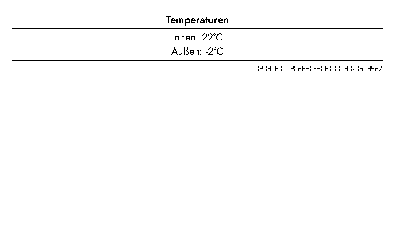
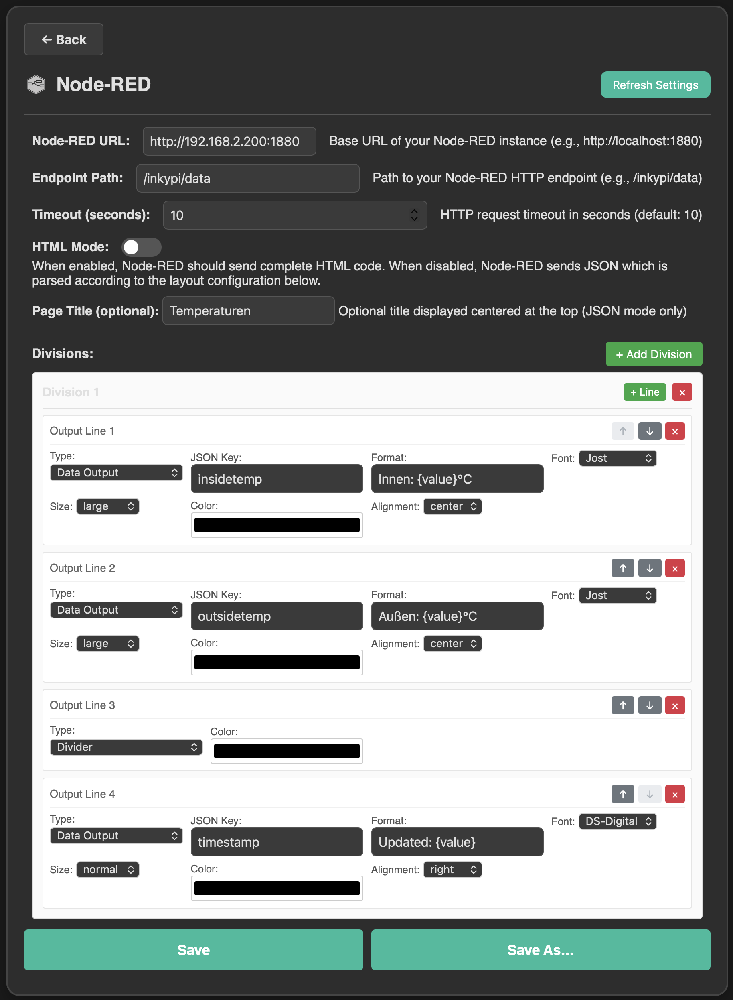

# InkyPi-Plugin-NodeRed


*InkyPi-Plugin-NodeRed* is a plugin for [InkyPi](https://github.com/fatihak/InkyPi) that integrates with Node-RED to display data on InkyPi devices.

## Features

✅ **Two Display Modes:**
- **JSON Parsing Mode** - Configure layouts via web UI, extract data from JSON responses
- **HTML Mode** - Node-RED sends complete HTML, rendered directly

✅ **JSON Parsing Mode Features:**
- Configurable divisions (side-by-side in landscape, stacked in portrait)
- Output lines: Title, Divider, or Data Output
- Format strings with placeholders for flexible data display
- Font, size, color, and alignment options for each output
- Support for nested JSON keys (dot notation)
- Shows "??" when data not found

✅ **HTML Mode Features:**
- Direct HTML rendering from Node-RED
- Complete control over layout and styling
- No configuration needed - just send HTML

**Settings:**



### Install

Install the plugin using the InkyPi CLI, providing the plugin ID and GitHub repository URL:

```bash
inkypi plugin install node-red https://github.com/RobinWts/InkyPi-Plugin-NodeRed
```
or install the [PluginManager](https://github.com/RobinWts/InkyPi-Plugin-PluginManager) first and use that to install via WebUI.


## Usage:

## Mode 1: JSON Parsing Mode (Default)

**Best for:** Structured data display with configurable layouts, divisions, and formatting.

### How It Works

1. **In Node-RED Flow:**
   - Add an **HTTP In** node configured as:
     - Method: `GET`
     - URL: `/inkypi/data` (or any custom path)
   - Add a **Function** node (optional) to format your data:
     ```javascript
     // Format your data here
     msg.payload = {
         temperature: flow.get("temperature") || 0,
         humidity: flow.get("humidity") || 0,
         timestamp: new Date().toISOString()
     };
     return msg;
     ```
   - Add an **HTTP Response** node configured as:
     - Status Code: `200`
     - Headers: `Content-Type: application/json`
   - Wire them together: `HTTP In` → `Function` → `HTTP Response`

2. **In InkyPi Plugin:**
   - Configure the layout using divisions and output lines
   - Make HTTP GET requests to: `http://[node-red-host]:[port]/inkypi/data`
   - Parse the JSON response
   - Extract data using configured JSON keys
   - Display the data according to layout configuration

### Advantages
- ✅ Uses only built-in Node-RED nodes
- ✅ Simple to set up in Node-RED
- ✅ Flexible layout configuration via web UI
- ✅ Standard HTTP/JSON - easy to debug
- ✅ Can add authentication via `httpNodeMiddleware` if needed
- ✅ Supports nested JSON keys (dot notation)

---

## Mode 2: HTML Mode

**Best for:** Complete control over display layout, custom styling, or complex HTML structures.

### How It Works

1. **In Node-RED Flow:**
   - Add an **HTTP In** node configured as:
     - Method: `GET`
     - URL: `/inkypi/data` (or any custom path)
   - Add a **Function** node to generate HTML:
     ```javascript
     // Generate complete HTML
     msg.payload = `
     <div style="padding: 20px; font-family: Arial;">
         <h1>Temperature: ${flow.get("temperature")}°C</h1>
         <p>Humidity: ${flow.get("humidity")}%</p>
         <p>Time: ${new Date().toLocaleString()}</p>
     </div>
     `;
     return msg;
     ```
   - Add an **HTTP Response** node configured as:
     - Status Code: `200`
     - Headers: `Content-Type: text/html`
   - Wire them together: `HTTP In` → `Function` → `HTTP Response`

2. **In InkyPi Plugin:**
   - Enable "HTML Mode" toggle in settings
   - Make HTTP GET requests to: `http://[node-red-host]:[port]/inkypi/data`
   - Receive HTML response
   - Render HTML directly to e-ink display

### Advantages
- ✅ Complete control over HTML structure and styling
- ✅ Can use any HTML/CSS features
- ✅ No layout configuration needed in InkyPi
- ✅ Perfect for complex dashboards or custom designs
- ✅ Uses only built-in Node-RED nodes

### HTML Mode Requirements
- Node-RED must return valid HTML (can include CSS inline or in `<style>` tags)
- HTML should be optimized for e-ink displays 
- Recommended to use responsive CSS for different display sizes
- HTML is rendered at the device's resolution

### Example Node-RED Flow JSON (JSON Mode)
```json
[
    {
        "id": "http-in-1",
        "type": "http in",
        "z": "flow1",
        "name": "InkyPi Data",
        "url": "/inkypi/data",
        "method": "get",
        "wires": [["function-1"]]
    },
    {
        "id": "function-1",
        "type": "function",
        "z": "flow1",
        "name": "Format Data",
        "func": "msg.payload = {\n    temperature: flow.get('temp') || 0,\n    status: 'active'\n};\nreturn msg;",
        "wires": [["http-response-1"]]
    },
    {
        "id": "http-response-1",
        "type": "http response",
        "z": "flow1",
        "name": "",
        "statusCode": "200",
        "headers": {"Content-Type": "application/json"},
        "wires": []
    }
]
```

### Example Node-RED Flow (HTML Mode)
```json
[
    {
        "id": "http-in-1",
        "type": "http in",
        "z": "flow1",
        "name": "InkyPi HTML",
        "url": "/inkypi/html",
        "method": "get",
        "wires": [["function-1"]]
    },
    {
        "id": "function-1",
        "type": "function",
        "z": "flow1",
        "name": "Generate HTML",
        "func": "const temp = flow.get('temperature') || 0;\nconst html = `\n<div style='padding: 20px; font-family: Arial;'>\n    <h1>Temperature: ${temp}°C</h1>\n    <p>Time: ${new Date().toLocaleString()}</p>\n</div>\n`;\nmsg.payload = html;\nreturn msg;",
        "wires": [["http-response-1"]]
    },
    {
        "id": "http-response-1",
        "type": "http response",
        "z": "flow1",
        "name": "",
        "statusCode": "200",
        "headers": {"Content-Type": "text/html"},
        "wires": []
    }
]
```

## Choosing Between Modes

**Use JSON Parsing Mode when:**
- You want to configure the layout via InkyPi's web UI
- You need flexible data extraction from JSON
- You want to reuse the same layout with different data sources
- You prefer visual configuration over coding HTML

**Use HTML Mode when:**
- You need complete control over HTML structure
- You have complex layouts that are easier to code than configure
- You want to use advanced CSS features
- You're building a custom dashboard design


## Development-status

In development

## License

This project is licensed under the GNU public License.
